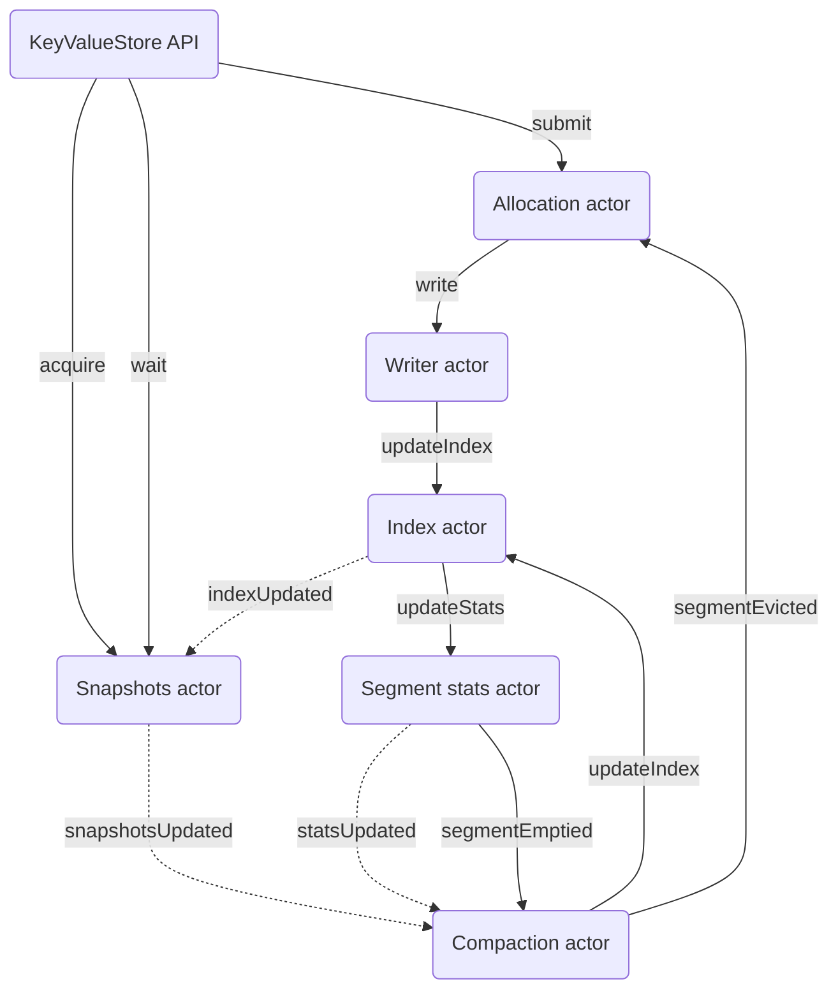

# Actor mesh

See also [ADR-02](./adr-02-actor-based-concurrency.md).

## Overview

The following diagram shows the relationship between the client-facing API and main actors in the system.

### Legend
* Solid lines: all messages delivered individually
* Dotted lines: only latest message delivered

## Actors

| Name | Key responsibilities |
| --- | --- |
| `AllocationActor` | Distributes incoming write batches to tables |
| `WriterActor` | Serializes incoming write batches to segments |
| `IndexActor` | Owns and updates main index in response to writes |
| `SnapshotsActor` | Issues and tracks snapshots of the store's contents |
| `SegmentStatsActor` | Tracks utilization of all segments |
| `CompactionActor` | Merges under-utilized segments to enforce balance invariants |

## Messages

| Name | From | To | Description |
| --- | --- | --- | --- |
| `submit` | `KeyValueStore` | `AllocationActor` | Submit a write batch |
| `acquire` | `KeyValueStore` | `SnapshotsActor` | Acquire a snapshot |
| `wait` | `KeyValueStore` | `SnapshotsActor` | Wait until a given write is observable in the store |
| `write` | `AllocationActor` | `WriterActor` | Serialize a write batch to a segment |
| `updateIndex` | `WriterActor` | `IndexActor` | Update index to reflect written data |
| `indexUpdated` | `IndexActor` | `SnapshotsActor` | Announce an updated index |
| `updateStats` | `IndexActor` | `SegmentStatsActor` | Update stats to reflect write |
| `statsUpdated` | `SegmentStatsActor` | `CompactionActor` | Announce an update in segment stats |
| `segmentEmptied` | `SegmentStatsActor` | `CompactionActor` | Announce that a segment no longer contains live data |
| `updateIndex` | `CompactionActor` | `IndexActor` | Update index to reflect compaction |
| `segmentEvicted` | `CompactionActor` | `AllocationActor` | Remove a segment because it no longer holds observable data |