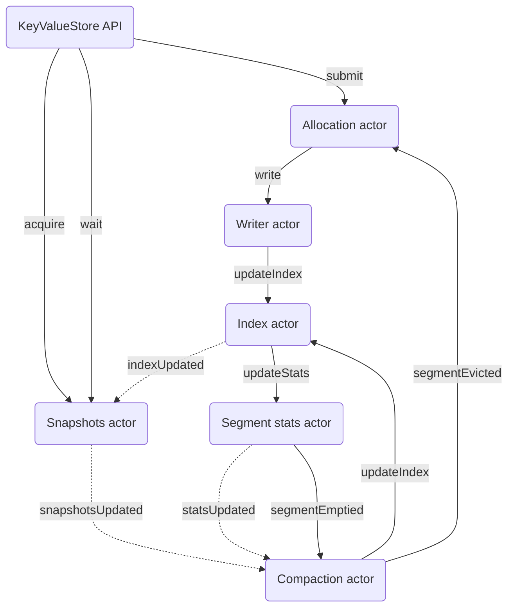

# Actor mesh

The following diagram shows the relationship between the client-facing API and main actors in the system.

### Legend
* Solid lines: all messages delivered individually
* Dotted lines: only latest message delivered